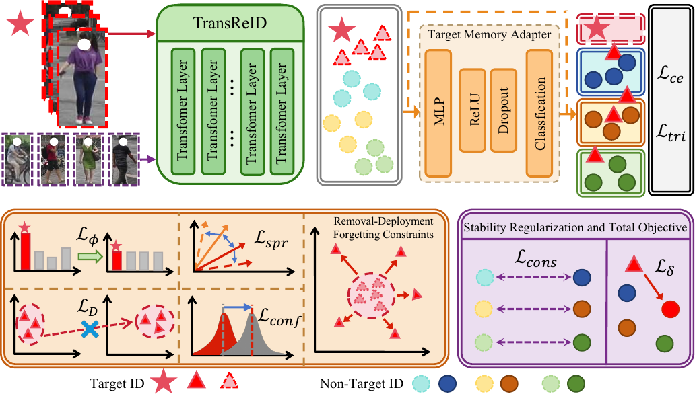

# TIU-ReID: Target Identity Unlearning for Person Re-Identification

Authors: Jingong Chen, Dongyoun Kim, Chulwoo Pack, Jun Huang, Kwanghee Won*

[Paper](https://openaccess.thecvf.com/content/CVPR2026W/MUV/papers/Chen_TIU-ReID_Target_Identity_Unlearning_for_Person_Re-Identification_CVPRW_2026_paper.pdf): CVPR2026 Workshop

### Abstract

When a deployed ReID system must forget a specific identity due to privacy regulations or removal requests, retraining from scratch is operationally infeasible, yet simply deleting images leaves discriminative identity evidence silently encoded in the model weights. We propose **TIU-ReID**, which enforces *responsibility migration* via a removable Target Memory Adapter and complementary forgetting objectives including entropy maximization, adversarial indistinguishability, directional confusion, and embedding dispersion, so that disabling the adapter at inference suppresses target retrievability without touching the backbone. We evaluate under a rigorous protocol with M=200 hard distractors and cross-camera constraints, achieving DropR 0.527 for a single target and DropR 0.714±0.249 across ten targets and three seeds on Market1501. Non-target utility and test-split generalization remain intact with Ret mAP 0.982 and Test mAP 0.831, confirming that identity erasure is achievable through component removal alone.



### Environment

```bash
conda env create -f env/env_cuda118.yml
conda activate reid_unlearning
```

Before running any script (from the repo root):

```bash
source scripts/env.sh
export PYTHONPATH="$(pwd):${PYTHONPATH}"
```

### Dataset

Put Market1501 under `data/market1501/Market-1501-v15.09.15/` (with `bounding_box_train/`, `bounding_box_test/`, `query/`), or run `bash scripts/download_datasets.sh`.

### Pre-trained weights

Download `tiu_reid_weights_market1501.tar.gz` from the [Releases](../../releases) page (TransReID teacher + TIU-ReID checkpoint for target ID 2) and extract it at the repo root:

```bash
tar xzf tiu_reid_weights_market1501.tar.gz
```

To train the teacher yourself instead:

```bash
bash scripts/train_teacher_transreid.sh market1501 market_teacher_r50
```

### Prepare splits and probes

```bash
python scripts/make_splits.py --dataset market1501 --seed 0 --forget_id 2 \
  --out_dir output/splits/market1501/seed0_tid2

python scripts/extract_teacher_features.py \
  --cfg output/transreid/market_teacher_r50/teacher_cfg_path.txt \
  --weights "$(cat output/transreid/market_teacher_r50/teacher_weights_path.txt)" \
  --out_dir output/mvp/auto_market1501_id2_seed0_t3 \
  --split_dir output/splits/market1501/seed0_tid2

python scripts/make_probe_sets.py \
  --split_dir output/splits/market1501/seed0_tid2 \
  --out_dir output/probes/market1501/seed0_hard200_tid2 \
  --distractor_mode hard --forget_distractor_ids 200 --enforce_cross_cam 1 \
  --feat_train_npz output/mvp/auto_market1501_id2_seed0_t3/features/train_teacher.npz
```

### Training

```bash
TEACHER_CFG="$(cat output/transreid/market_teacher_r50/teacher_cfg_path.txt)"
TEACHER_WEIGHTS="$(cat output/transreid/market_teacher_r50/teacher_weights_path.txt)"

python scripts/train_removable_unlearn_v3.py \
  --cfg "$TEACHER_CFG" --weights "$TEACHER_WEIGHTS" \
  --out_dir output/removable/my_tiu_run \
  --dataset market1501 --forget_id 2 --seed 0 \
  --epochs 15 --max_steps 200 --batch 16 \
  --lambda_baseonly_forget 2.0 --lambda_adv 0.1 \
  --lambda_feat_confuse 1.0 --lambda_feat_spread 1.0 \
  --probe_dir output/probes/market1501/seed0_hard200_tid2
```

- `--forget_id`: the target identity to unlearn.
- `--lambda_baseonly_forget`: weight of the entropy-maximization loss (λ_∅ in the paper).
- `--lambda_adv`: weight of the adversarial discriminator loss L_D (GRL coefficient: `--grl_lambda`).
- `--lambda_feat_confuse`: weight of the directional confusion loss L_conf.
- `--lambda_feat_spread`: weight of the embedding dispersion loss L_spr.
- `--target_base_scale`: cancellation scale *s* coupling the two deployments.

### Test

Probe evaluation (Full = adapter enabled, Removal = adapter disabled):

```bash
RUN=output/removable/removable_market1501_id2_seed0_retfix_F   # or your own run dir

python scripts/eval_removable_modes.py \
  --cfg "$(cat output/transreid/market_teacher_r50/teacher_cfg_path.txt)" \
  --base_ckpt $RUN/base_ckpt.pth --target_module $RUN/target_module.pth \
  --forget_id 2 \
  --probe_dir output/probes/market1501/seed0_hard200_tid2 \
  --split_dir output/splits/market1501/seed0_tid2 \
  --feat_train_npz output/mvp/auto_market1501_id2_seed0_t3/features/train_teacher.npz \
  --out_dir $RUN/eval_probe
```

Standard Market1501 test split:

```bash
python scripts/eval_test_split.py --mvp_dir $RUN \
  --cfg output/transreid/market_teacher_r50/teacher_cfg_path.txt \
  --forget_id 2 --target_base_scale 0.0
```

Expected for the released checkpoint (target ID 2, seed 0): Ret mAP ≈ 0.945, Fgt mAP ≈ 0.473 under Removal → DropR ≈ 0.527.

### Paper experiments

- Loss-term ablation (3 seeds): `bash scripts/run_ablation_multi_seed.sh`, then `bash scripts/eval_ablation_multi_seed.sh` and `python scripts/aggregate_ablation_table.py`.
- Baselines in Table 1: `bash scripts/run_baselines.sh`, `python scripts/train_baseline_finetune_no_target.py / train_baseline_negative_gradient.py / train_baseline_head_only.py`.
- Multi-target (10 IDs × 3 seeds) and tuning grid: `python scripts/run_multitarget_v2.py`.
- All figures: `bash scripts/run_all_tiu_plots.sh`.

### Citation

If you find this work useful, please cite:

```
@InProceedings{Chen_2026_CVPR,
    author    = {Chen, Jingong and Kim, Dongyoun and Pack, Chulwoo and Huang, Jun and Won, Kwanghee},
    title     = {TIU-ReID: Target Identity Unlearning for Person Re-Identification},
    booktitle = {Proceedings of the IEEE/CVF Conference on Computer Vision and Pattern Recognition (CVPR) Workshops},
    month     = {June},
    year      = {2026},
    pages     = {8506-8515}
}
```

### Acknowledgement

The backbone builds on [TransReID](https://github.com/damo-cv/TransReID) (MIT License), vendored under `third_party/TransReID` with minor compatibility patches (see `third_party/README.md`).
